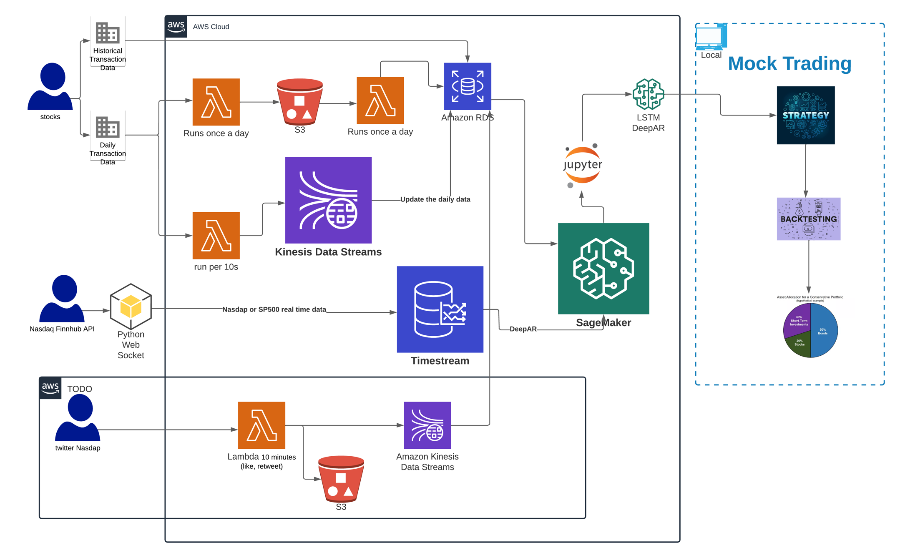

# Presentation
Final-Term Forecasting Time Series Stock Data On AWS.pptx

# Data

### Save history daily stock data
- save_historical_transaction_data

### Save new daily stock data
- AWS RDS, S3 & Lambda: Recheck daily data after stock marketing closed
  - stock-daily-data-to-s3
  - stock-daily-data-froms3-to-rds

- AWS Kinesis & Lambda: Update daily data per 10 seconds
  - daily-stock-price-kinesis-producer: call API per 10 seconds
  - daily-stock-price-kinesis-consumer

### Save real time stock data from a websocket to AWS TimeSteam Database

- Websocket & TimeSteam Database: 
  - save_real_time_price_websocket

# LSTM & DeepAR
- SageMaker:
  - LSTM_final_1day_portfoliofinal.ipynb
  - LSTM_TimeStream_60s_portfolio_final.ipynb

  - DeepAR_1day_portpolio_final.ipynb
  - DeepAR_TimeStream_1min_portfolio_final.ipynb

# Mock Testing
- Python:
  - https://github.com/Yuehao-Wang/real-time-stock-prediction/tree/main/mock_trading
  - Mock data sample: https://github.com/Yuehao-Wang/real-time-stock-prediction/blob/main/mock_trading/aapl.csv

  - We can create any strategies like strategy_ma20vsma80.py to evaluate models.

# Architecture Diagram

